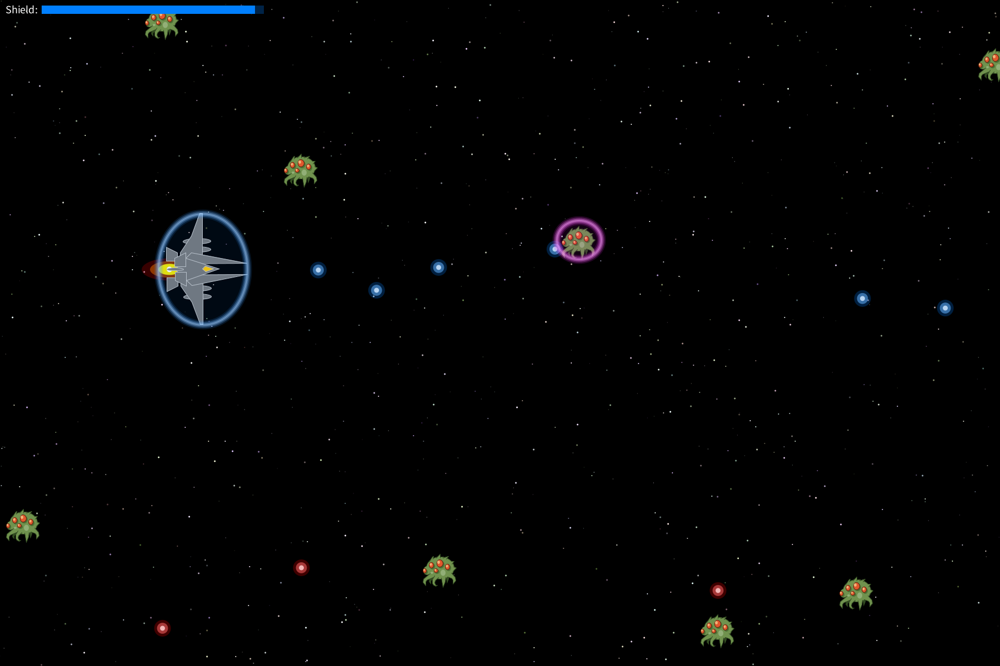

# Void Patrol

*Void Patrol* is a free and retro-style arcade space shooter: pilot your ship through deep space, dodge enemy fire, and fight hostile alien crafts. The game is built in Processing (Python mode) and released as open source — free to play, modify, and share.

[→ License: GNU General Public License v3.0](LICENSE)
